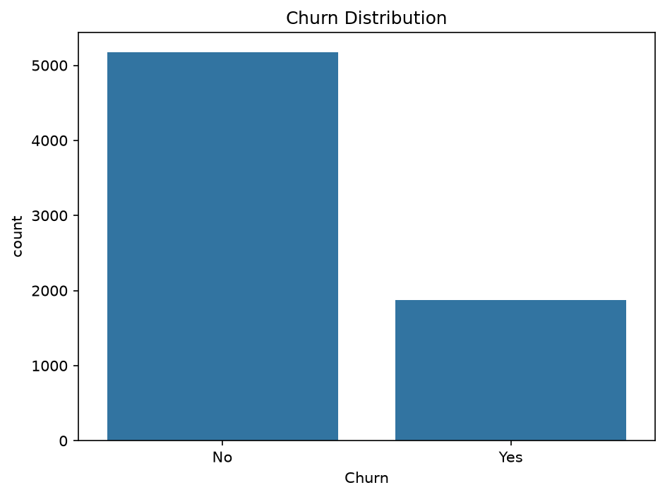
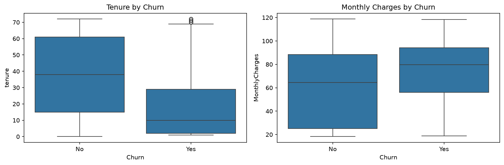
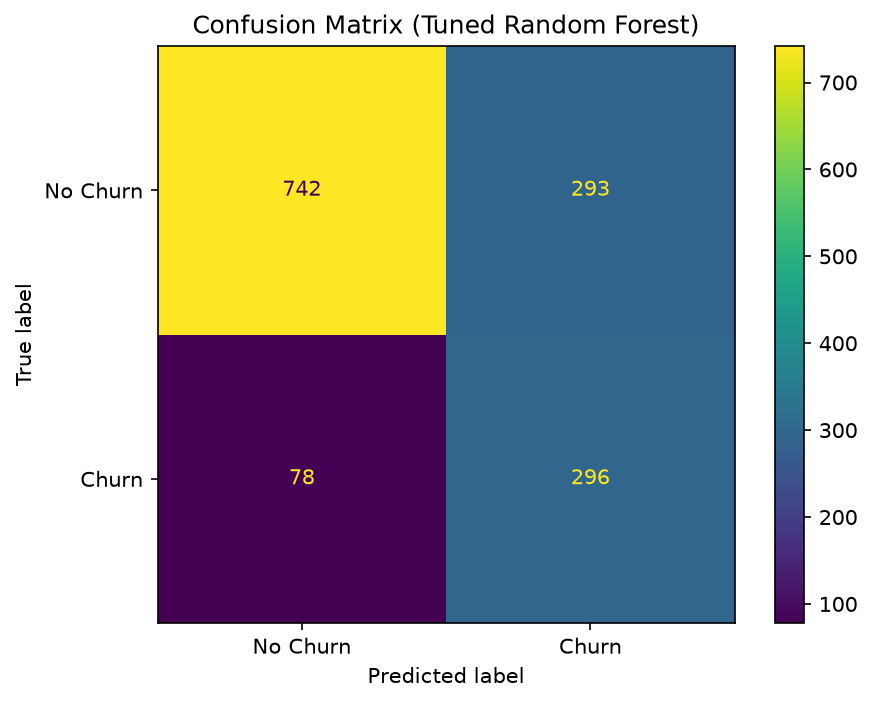
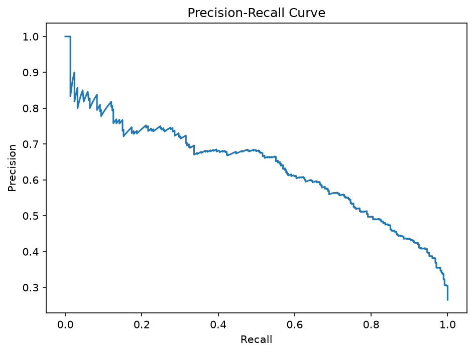
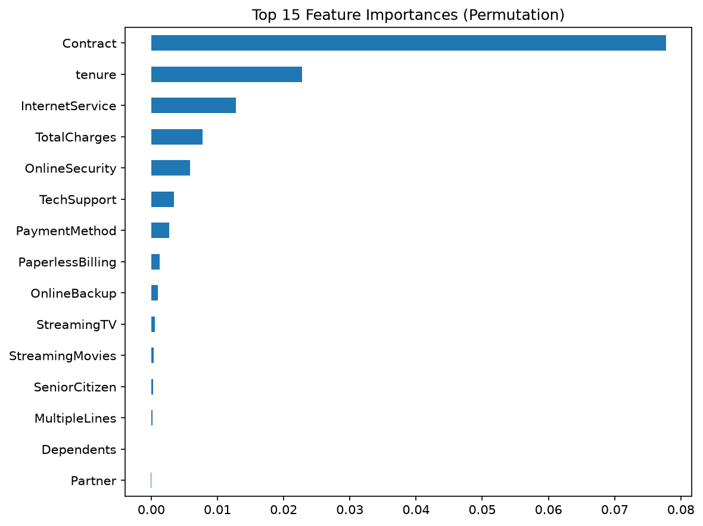

# Customer Churn Prediction with Scikit-Learn

End-to-end scikit-learn pipeline for predicting Telco customer churn: EDA → preprocessing → model comparison → hyperparameter tuning → evaluation → interpretability.

**Final model:** Tuned Random Forest (`max_depth=5`, `min_samples_split=5`, `n_estimators=100`)  
**Test ROC-AUC:** **0.839** · **Churn recall:** **0.79** · **Churn precision:** **0.50**

---

## Overview

Customer churn hits recurring revenue (CLV, ARPU). This project builds a leakage-safe preprocessing + modeling pipeline that:

1. Identifies customers likely to churn
2. Prioritizes **recall on the churn class** (missed churners are costly)
3. Explains which features drive predictions via permutation importance

All figures below are generated by `notebooks/churn_analysis.ipynb` and saved under [`graphs/`](graphs/).

---

## Dataset

[Telco Customer Churn](https://www.kaggle.com/datasets/blastchar/telco-customer-churn) (Kaggle / IBM sample)

| Property | Value |
|---|---|
| Rows | 7,043 customers |
| Columns | 21 (demographics, services, billing, churn label) |
| Target | `Churn` ∈ {Yes, No} |
| Class balance | **73.5% No** / **26.5% Yes** (imbalanced) |

Place the CSV at:

```text
data/WA_Fn-UseC_-Telco-Customer-Churn.csv
```

**Cleaning steps used in the notebook:**

- Coerce `TotalCharges` to numeric (blank strings → NaN)
- Impute remaining NaNs with the median
- Drop `customerID` (identifier, not predictive)

---

## Exploratory Data Analysis

### Class imbalance

Churn is the minority class (~26.5%). Models use `class_weight='balanced'` so the learner does not ignore churners.



**Takeaway:** Accuracy alone is misleading. Prefer ROC-AUC and churn recall/precision when evaluating.

### Tenure and monthly charges vs churn



| Feature | Median (No churn) | Median (Churn) |
|---|---|---|
| `tenure` (months) | **38** | **10** |
| `MonthlyCharges` | **$64.43** | **$79.65** |

**Conclusions from EDA:**

- Churners have much **shorter tenure** — early-lifecycle customers are higher risk.
- Churners pay **higher monthly charges** on average — high spend + short tenure is a warning pattern.
- These relationships motivate including both numeric billing features and contract/service categoricals in the model.

---

## Approach

1. **Train/test split** — 80/20, stratified on churn (`random_state=42`)
2. **Preprocessing** — `ColumnTransformer`:
   - Numeric (`tenure`, `MonthlyCharges`, `TotalCharges`) → `StandardScaler`
   - Remaining categoricals → `OneHotEncoder(handle_unknown='ignore')`
   - Fit only on training data (inside a `Pipeline`) to avoid leakage
3. **Baseline** — Logistic Regression with `class_weight='balanced'`
4. **Stronger models** — Random Forest (balanced) and HistGradientBoosting
5. **Validation** — 5-fold `StratifiedKFold` ROC-AUC
6. **Tuning** — `GridSearchCV` on Random Forest hyperparameters
7. **Evaluation** — classification report, confusion matrix, precision–recall curve
8. **Interpretability** — permutation importance on original input columns

---

## Model Comparison

ROC-AUC on the held-out test set (untuned RF / HGB) and CV for the tuned RF:

| Model | Metric | Score |
|---|---|---|
| Logistic Regression (balanced) | Test ROC-AUC | **0.841** |
| Random Forest (default, balanced) | Test ROC-AUC | 0.820 |
| HistGradientBoosting (default) | Test ROC-AUC | 0.835 |
| Random Forest (5-fold CV, untuned) | CV ROC-AUC | 0.822 ± 0.012 |
| **Random Forest (tuned)** | **Best CV ROC-AUC** | **0.845** |
| **Random Forest (tuned)** | **Test ROC-AUC** | **0.839** |

**Best hyperparameters** (`GridSearchCV`, scoring=`roc_auc`):

```text
classifier__max_depth=5
classifier__min_samples_split=5
classifier__n_estimators=100
```

**Conclusions from modeling:**

- Logistic Regression is a strong, simple baseline (test ROC-AUC 0.841).
- Untuned Random Forest underperforms the linear baseline; **shallow trees** (`max_depth=5`) improve generalization and lift CV ROC-AUC to **0.845**.
- The tuned RF is selected as the final production-style artifact (`models/best_model.pkl`) because it matches or exceeds the baseline while remaining nonlinear and interpretable via permutation importance.

---

## Final Evaluation (Tuned Random Forest)

Test set size: **1,409** customers (1,035 non-churn / 374 churn).

### Classification report

| Class | Precision | Recall | F1 | Support |
|---|---|---|---|---|
| No Churn (0) | 0.90 | 0.72 | 0.80 | 1,035 |
| **Churn (1)** | **0.50** | **0.79** | 0.61 | 374 |
| Accuracy | | | 0.74 | 1,409 |

**Test ROC-AUC: 0.839**

### Confusion matrix



| | Predicted No Churn | Predicted Churn |
|---|---|---|
| **Actual No Churn** | TN = 742 | FP = 293 |
| **Actual Churn** | FN = **78** | TP = 296 |

**Business reading:**

- Of 374 true churners, the model catches **296 (79%)** and misses **78**.
- Precision on churn is **0.50** — about half of “predicted churn” alerts are false positives.
- That tradeoff is intentional with `class_weight='balanced'`: **favor finding churners** (high recall) over perfect alert precision. Retention teams can re-rank or threshold scores using the PR curve below.

### Precision–recall curve



**Conclusion:** Operating threshold can be moved along the PR curve depending on outreach capacity. Higher thresholds raise precision (fewer false alarms) but lower recall (more missed churners).

---

## What Drives Churn? (Permutation Importance)

Permutation importance measures how much test ROC-AUC drops when each **original** feature is shuffled (compatible with the full preprocessing pipeline).



**Top drivers (mean importance):**

| Rank | Feature | Importance |
|---|---|---|
| 1 | **Contract** | 0.078 |
| 2 | **tenure** | 0.023 |
| 3 | **InternetService** | 0.013 |
| 4 | TotalCharges | 0.008 |
| 5 | OnlineSecurity | 0.006 |
| 6 | TechSupport | 0.003 |
| 7 | PaymentMethod | 0.003 |

**Conclusions for the business:**

1. **Contract type** is by far the strongest signal — month-to-month customers are the primary retention risk; longer contracts reduce churn propensity.
2. **Tenure** confirms the EDA story: newer customers churn more; onboarding and early-life interventions matter.
3. **Internet service** (e.g. fiber vs DSL / none) is a major product-level driver.
4. Add-on security/support features (`OnlineSecurity`, `TechSupport`) contribute modestly — bundling support may help stickiness.
5. Demographics (`Partner`, `Dependents`, `SeniorCitizen`) contribute little once contract, tenure, and service mix are accounted for.

---

## Project Structure

```text
customer-churn-prediction-sklearn/
├── data/                         # raw Telco CSV
├── graphs/                       # all notebook / evaluate plots
│   ├── churn_distribution.png
│   ├── tenure_monthlycharges_by_churn.png
│   ├── confusion_matrix.png
│   ├── precision_recall_curve.png
│   └── feature_importance.png
├── notebooks/
│   └── churn_analysis.ipynb      # full EDA + modeling walkthrough
├── src/
│   ├── preprocessing.py          # load + ColumnTransformer pipeline
│   ├── train.py                  # compare models, tune, save .pkl
│   └── evaluate.py               # metrics + plots → graphs/
├── models/
│   └── best_model.pkl            # tuned Random Forest pipeline
├── requirements.txt
└── README.md
```

---

## Setup

```bash
git clone https://github.com/<your-username>/customer-churn-prediction-sklearn.git
cd customer-churn-prediction-sklearn
pip install -r requirements.txt
```

Download the Kaggle CSV into `data/WA_Fn-UseC_-Telco-Customer-Churn.csv`.

---

## Usage

### Option A — Notebook (exploration)

Open `notebooks/churn_analysis.ipynb` and run top to bottom. Figures are written to `graphs/`.

> Tip: set Cursor/VS Code **Jupyter › Notebook File Root** to `${workspaceFolder}` so paths like `data/...` and `graphs/...` resolve from the project root.

### Option B — CLI (reproducible pipeline)

From the **project root**:

```bash
python src/train.py --data data/WA_Fn-UseC_-Telco-Customer-Churn.csv --out models/best_model.pkl
python src/evaluate.py --model models/best_model.pkl
```

`train.py` compares candidates with stratified CV, tunes the winner, and saves the fitted pipeline.  
`evaluate.py` prints a classification report and refreshes plots in `graphs/`.

---

## Key Takeaways

1. **~27% churn rate** → treat as an imbalanced problem; optimize for ranking quality (ROC-AUC) and churn recall.
2. **Short tenure + higher monthly charges** characterize churners in EDA.
3. A **shallow, balanced Random Forest** (depth 5) reaches **~0.84 ROC-AUC** and **~79% churn recall** on the test set.
4. **Contract**, **tenure**, and **InternetService** dominate permutation importance — retention strategy should focus on locking in contract length and supporting early-tenure / high-risk internet customers.
5. Precision at the default threshold is moderate (~0.50); use the **precision–recall curve** to set a business-appropriate decision threshold.

---

## Tech Stack

Python · scikit-learn · pandas · matplotlib / seaborn · joblib

---

## Future Work

- Threshold / cost-sensitive optimization (explicit FN vs FP cost)
- SHAP values for per-customer explanations
- Neural network baseline for comparison
